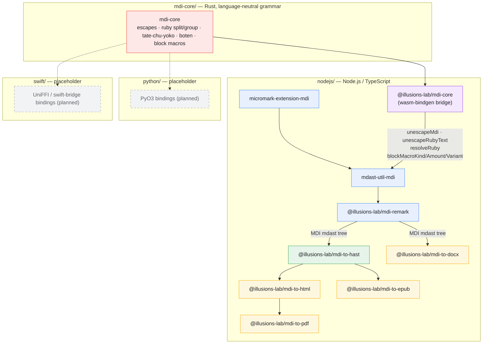

# MDI

[](https://codecov.io/github/illusions-lab/MDI)

**illusion Markdown (MDI)** is a Markdown extension format for Japanese typography — ruby, tate-chu-yoko, boten, warichu, vertical writing, and more, inherited on top of standard Markdown.

**illusion Markdown（MDI）** は、日本語組版のための Markdown 拡張フォーマットです。ルビ・縦中横・傍点・割注・縦書きなどを、標準 Markdown を継承しつつ拡張します。

This repository is the canonical home of the **MDI spec** ([SYNTAX.md](./SYNTAX.md)) and its per-language implementations; it currently targets **MDI 2.0**.  
本リポジトリは **MDI 仕様書**（[SYNTAX.md](./SYNTAX.md)）と各言語の実装の両方を管理しており、現行仕様は **MDI 2.0** です。

**📖 Documentation / ドキュメント: https://mdi.illusions.app/** — guides, a live-rendered syntax showcase, and generated API reference (English / 日本語 / 正體中文). Built from [`nodejs/docs/`](./nodejs/docs).

---

## Repository layout / リポジトリ構成

MDI implementations are split by language, each a self-contained project rooted at the repo top level. Only the Node.js tooling is implemented so far; the others are placeholders.

MDI の実装は言語ごとに分割されており、各ディレクトリはリポジトリ直下に置かれた独立したプロジェクトです。今のところ実装があるのは Node.js のみで、他は雛形（プレースホルダー）です。

| Directory | Language | Status |
|-----------|----------|--------|
| [`mdi-core/`](./mdi-core) | Rust | Language-neutral grammar core (escapes, ruby, tate-chu-yoko, macros). Compiled to wasm and consumed by `nodejs/`'s `mdast-util-mdi` for the semantic resolution layer (ruby split/group, block-macro classification, escape handling). Not yet consumed by Python or Swift. |
| [`nodejs/`](./nodejs) | Node.js / TypeScript | Parser, converters (HTML/PDF/EPUB/DOCX), CLI, and the docs site — see below. The tokenizer (`micromark-extension-mdi`) stays JavaScript-only; `mdast-util-mdi` bridges into `mdi-core` via [`@illusions-lab/mdi-core`](./nodejs/packages/mdi-core) (wasm-bindgen). |
| [`swift/`](./swift) | Swift | Placeholder package, not yet implemented. Will bind to `mdi-core` natively (UniFFI / swift-bridge) once built. |
| [`python/`](./python) | Python | Placeholder package, not yet implemented. Will bind to `mdi-core` natively (PyO3) once built. |

---

## Packages / パッケージ構成 (`nodejs/`)

| Package | Layer | Description |
|---------|-------|-------------|
| [`micromark-extension-mdi`](./nodejs/packages/micromark-extension-mdi) | Parser core | Tokenizes MDI inline/block syntax (ruby, tate-chu-yoko, boten, kerning, warichu, blank paragraphs, page breaks, block alignment) on top of CommonMark. |
| [`mdast-util-mdi`](./nodejs/packages/mdast-util-mdi) | Parser core | Compiles micromark-mdi token events into mdast nodes, and back into markdown. |
| [`@illusions-lab/mdi-remark`](./nodejs/packages/remark) | Parser core | A single `remark` plugin bundling GFM, YAML front matter, and the MDI extensions — the recommended entry point for producing an MDI mdast tree. |
| [`@illusions-lab/mdi-to-hast`](./nodejs/packages/to-hast) | Shared transform | Maps MDI mdast nodes to hast, following the HTML mapping defined in the spec. Shared foundation for the HTML, PDF, and EPUB converters. |
| [`@illusions-lab/mdi-to-html`](./nodejs/packages/to-html) | Converter | Renders hast to an HTML string with the default MDI stylesheet. |
| [`@illusions-lab/mdi-to-pdf`](./nodejs/packages/to-pdf) | Converter | Renders `@illusions-lab/mdi-to-html` output to PDF via a headless browser, to get correct `vertical-rl` / `text-combine-upright` / `text-emphasis` support. |
| [`@illusions-lab/mdi-to-epub`](./nodejs/packages/to-epub) | Converter | Serializes `@illusions-lab/mdi-to-hast` output to valid EPUB XHTML and packages it (OPF manifest, nav, spine split on chapter/page breaks). |
| [`@illusions-lab/mdi-to-docx`](./nodejs/packages/to-docx) | Converter | Maps mdast directly to OOXML (native `<w:ruby>`, `<w:eastAsianLayout>`, section-level vertical writing) — does not go through HTML. |
| [`@illusions-lab/mdi-cli`](./nodejs/packages/cli) | CLI | `mdi build input.mdi --to html\|pdf\|epub\|docx` — thin wrapper around the converters above. |

### Why this split / なぜこの分割か

Three of the four output formats (HTML, PDF, EPUB) are HTML-family formats and share the same mdast → hast mapping (`@illusions-lab/mdi-to-hast`); only DOCX is genuine OOXML and bypasses hast entirely. See the [architecture notes](#architecture--アーキテクチャ) below.

HTML・PDF・EPUB の 3 つは HTML 系フォーマットであり、同じ mdast → hast マッピング（`@illusions-lab/mdi-to-hast`）を共有します。DOCX のみ純粋な OOXML であり、hast を経由しません。詳細は下記アーキテクチャ節を参照してください。

---

## Architecture / アーキテクチャ



The **tokenizer** (`micromark-extension-mdi`) scans MDI syntax interleaved
character-by-character with CommonMark, so it stays JavaScript-only. The
**semantic resolution rules** inside `mdast-util-mdi` — ruby split/group
resolution, block-macro classification, MDI escape handling — call into
`mdi-core` through the wasm bridge instead of re-implementing the same rules
in TypeScript. Python and Swift don't carry that CommonMark-interleaving
constraint, so once built they can bind to `mdi-core` directly (native
PyO3 / UniFFI, no wasm hop).

All converters consume the **same mdast tree** produced by `@illusions-lab/mdi-remark`, so editor-path and export-path behavior stay in sync (see [SYNTAX.md § Parsing Order](./SYNTAX.md#parsing-order--パース順序)).

すべてのコンバータは `@illusions-lab/mdi-remark` が生成する**単一の mdast ツリー**を消費するため、エディタ側とエクスポート側の挙動が分岐しません。

---

## Development / 開発

`nodejs/` is a [pnpm](https://pnpm.io) + [Turborepo](https://turbo.build)
monorepo; `mdi-core/` is an independent Cargo project.

```bash
cd nodejs
pnpm install
pnpm build
pnpm test
```

```bash
cd mdi-core
cargo build
cargo test
```

`mdi-core` implements the MDI-only grammar (escapes, grapheme-aware ruby,
tate-chu-yoko, inline macros, and block macros) as a language-neutral AST.
`nodejs/` consumes it via a wasm-bindgen bridge
([`@illusions-lab/mdi-core`](./nodejs/packages/mdi-core)) for the semantic
resolution rules — ruby split/group, block-macro classification, and MDI
escape handling — inside `mdast-util-mdi`. The micromark tokenizer, which
scans MDI syntax interleaved character-by-character with CommonMark, stays
JavaScript-only. The canonical grammar and its versioned specification live
in [`SYNTAX.md`](./SYNTAX.md) in this repository. The Swift and Python
packages will bind to `mdi-core` directly (no wasm hop needed) once
implemented.

Rebuilding the wasm bridge needs a `wasm32-unknown-unknown` Rust target and
`wasm-pack` in addition to the plain `cargo build`/`cargo test` toolchain
above; `pnpm build` in `nodejs/` runs it as part of the normal workspace
build.

CI runs the Rust core natively on Linux, macOS, and Windows for both x64 and
ARM64. The JavaScript integration suite (including Chromium PDF output) runs
on Linux x64; platform-native bindings will use the same matrix when added.

### Versioning / バージョニング

Every package's version is `<MDI spec version>.<package release number>` — the major.minor pair always equals the MDI spec version this repo targets (currently `2.0`), and the patch number is each package's own independent release count, **starting at `.1`** (never `.0`) for the first release under a given spec version. For example the first release under MDI 2.0 is `2.0.1`; a later fix to just `@illusions-lab/mdi-to-docx` might be `2.0.7` while `@illusions-lab/mdi-to-html` is still `2.0.3` — patch numbers are independent per package, only major.minor is shared.

すべてのパッケージのバージョンは `<MDI 仕様バージョン>.<パッケージ自身のリリース回数>` です。major.minor はこのリポジトリが対応する MDI 仕様バージョン（現在 `2.0`）に常に一致し、patch は各パッケージが独自にカウントするリリース回数で、そのバージョンで最初のリリースは `.0` ではなく **`.1` から始まります**。例えば MDI 2.0 対応の初回リリースは `2.0.1`。以降、`@illusions-lab/mdi-to-docx` だけ修正を重ねて `2.0.7` になっても `@illusions-lab/mdi-to-html` は `2.0.3` のまま、というように patch は各パッケージ独立です。

- **Ordinary releases** (same spec version): use Changesets as normal — always choose a **patch** bump, never minor/major.  
  **通常のリリース**（同じ仕様バージョン内）: 通常どおり Changesets を使い、常に **patch** bump のみを選びます（minor/major は使いません）。

  ```bash
  cd nodejs
  pnpm changeset       # record what changed; always pick "patch"
  pnpm version         # apply pending changesets
  pnpm release         # build + publish
  ```

- **Spec version bump** (e.g. MDI 2.0 → 2.1): Changesets has no concept of "MDI spec version," so this is a separate, explicit step — it rewrites every package's version to `<new spec version>.1` regardless of each package's prior patch count.  
  **仕様バージョンの引き上げ**（例: MDI 2.0 → 2.1）: Changesets は「MDI 仕様バージョン」という概念を知らないため、これは別の明示的な手順です。各パッケージの直前の patch 数に関係なく、全パッケージのバージョンを `<新しい仕様バージョン>.1` へ書き換えます。

  ```bash
  cd nodejs
  pnpm bump-spec-version 2.1
  ```

---

## Related projects / 関連プロジェクト

- [illusions-lab/milkdown-mdi](https://github.com/illusions-lab/milkdown-mdi) — Milkdown editor plugins for MDI syntax support and vertical writing (縦書き) display.

---

## License

The Node.js tooling (`nodejs/`) and the Rust core (`mdi-core/`) are MIT — see [LICENSE](./LICENSE).

The MDI specification ([`SYNTAX.md`](./SYNTAX.md)) is public domain — see [LICENSE-SPEC](./LICENSE-SPEC).
