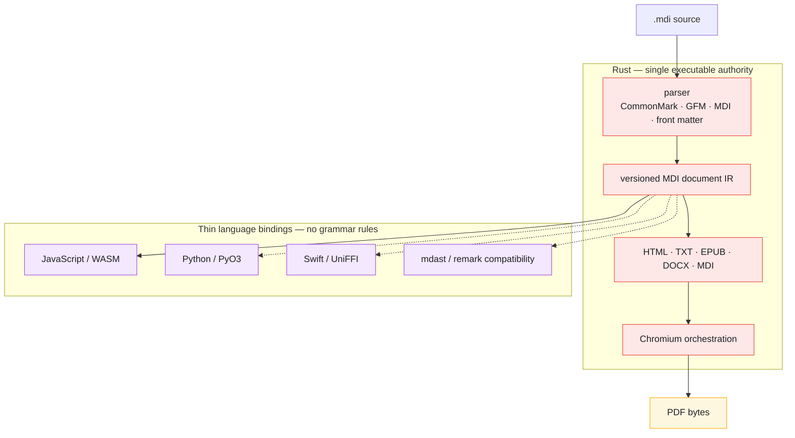

# MDI

[](https://codecov.io/github/illusions-lab/MDI)

**illusion Markdown (MDI)** is a Markdown extension format for Japanese typography — ruby, tate-chu-yoko, boten, warichu, vertical writing, and more, inherited on top of standard Markdown.

**illusion Markdown（MDI）** は、日本語組版のための Markdown 拡張フォーマットです。ルビ・縦中横・傍点・割注・縦書きなどを、標準 Markdown を継承しつつ拡張します。

This repository is the canonical home of the **MDI spec** ([SYNTAX.md](./SYNTAX.md)) and its per-language implementations; it currently targets **MDI 2.0**.  
本リポジトリは **MDI 仕様書**（[SYNTAX.md](./SYNTAX.md)）と各言語の実装の両方を管理しており、現行仕様は **MDI 2.0** です。

The project is migrating to a **Rust-authoritative architecture**: Rust is the
only executable implementation of MDI syntax and document semantics, while
JavaScript, Python, and Swift are thin bindings. See
[`ARCHITECTURE.md`](./ARCHITECTURE.md) for the target design, current migration
status, and staged plan.

本專案正遷移到 **Rust 單一權威架構**：MDI 語法與文件語義只在 Rust
實作，JavaScript、Python、Swift 僅提供薄接口。目標設計、目前狀態與分階段
計畫請見 [`ARCHITECTURE.md`](./ARCHITECTURE.md)。

**📖 Documentation / ドキュメント: https://mdi.illusions.app/** — guides, a live-rendered syntax showcase, and generated API reference (English / 日本語 / 正體中文). Built from [`nodejs/docs/`](./nodejs/docs).

---

## Repository layout / リポジトリ構成

MDI exposes language-specific packages, but they are moving toward bindings over one Rust implementation rather than independent implementations.

各言語向けパッケージは、独立した構文実装ではなく、単一の Rust 実装に接続する薄いバインディングへ移行中です。現在は Node.js 向けの第 1 段階を実装済みで、Swift と Python は雛形（プレースホルダー）です。

| Directory | Language | Status |
|-----------|----------|--------|
| [`mdi-core/`](./mdi-core) | Rust | Canonical parser and document IR under active migration. Stage 1 exposes the Rust-owned syntax tree to JavaScript through wasm. |
| [`nodejs/`](./nodejs) | Node.js / TypeScript | JavaScript binding, compatibility packages, current converters, CLI, and docs. The current micromark parser remains temporarily as a differential-test oracle. |
| [`swift/`](./swift) | Swift | Placeholder package, not yet implemented. Will bind to `mdi-core` natively (UniFFI / swift-bridge) once built. |
| [`python/`](./python) | Python | Placeholder package, not yet implemented. Will bind to `mdi-core` natively (PyO3) once built. |

---

## Packages / パッケージ構成 (`nodejs/`)

| Package | Layer | Description |
|---------|-------|-------------|
| [`@illusions-lab/mdi`](./nodejs/packages/mdi) | JavaScript binding | Thin typed interface over the Rust parser. Stage 1 exposes the versioned MDI-only syntax IR and explicit capability flags. |
| [`micromark-extension-mdi`](./nodejs/packages/micromark-extension-mdi) | Legacy parser | Current micromark tokenizer, retained temporarily as a compatibility layer and differential-test oracle during the Rust migration. |
| [`mdast-util-mdi`](./nodejs/packages/mdast-util-mdi) | Legacy adapter | Current micromark/mdast adapter and serializer, retained for compatibility during migration. |
| [`@illusions-lab/mdi-remark`](./nodejs/packages/remark) | Compatibility API | Current remark entry point for GFM, YAML front matter, and MDI. It will become an adapter over the Rust IR rather than remain a syntax authority. |
| [`@illusions-lab/mdi-to-hast`](./nodejs/packages/to-hast) | Current transform | Maps the current MDI mdast tree to hast. Its deterministic mapping is scheduled to move to Rust. |
| [`@illusions-lab/mdi-to-html`](./nodejs/packages/to-html) | Current converter | Renders hast to HTML with the default MDI stylesheet; this deterministic renderer is scheduled to move to Rust. |
| [`@illusions-lab/mdi-to-pdf`](./nodejs/packages/to-pdf) | Current converter | Renders HTML to PDF through headless Chromium. The target implementation keeps Chromium but moves process control to Rust. |
| [`@illusions-lab/mdi-to-epub`](./nodejs/packages/to-epub) | Current converter | Produces EPUB XHTML and packaging; scheduled to move to Rust. |
| [`@illusions-lab/mdi-to-docx`](./nodejs/packages/to-docx) | Current converter | Maps mdast directly to OOXML; scheduled to move to Rust. |
| [`@illusions-lab/mdi-cli`](./nodejs/packages/cli) | CLI | `mdi build input.mdi --to html\|pdf\|epub\|docx` — thin wrapper around the converters above. |

### Why this split / なぜこの分割か

In the current JavaScript implementation, HTML, PDF, and EPUB share the same mdast → hast mapping (`@illusions-lab/mdi-to-hast`), while DOCX maps directly to OOXML. This is an implementation detail of the migration baseline, not a constraint on the target Rust architecture. See the [architecture notes](#architecture--アーキテクチャ) below.

現在の JavaScript 実装では HTML・PDF・EPUB が同じ mdast → hast マッピング（`@illusions-lab/mdi-to-hast`）を共有し、DOCX は OOXML へ直接変換します。これは移行元実装の構成であり、目標とする Rust アーキテクチャの制約ではありません。詳細は下記アーキテクチャ節を参照してください。

---

## Architecture / アーキテクチャ

The target architecture is deliberately simple: source enters Rust once, and
all language packages consume the same versioned document IR. Deterministic
renderers will move to Rust; PDF will use HTML/CSS generated by Rust and a
Chromium process controlled by Rust.



During migration, the existing JavaScript micromark/remark pipeline and
converters remain available for differential testing. They are not a second
long-term syntax implementation. The detailed ownership rules and migration
stages are documented in [`ARCHITECTURE.md`](./ARCHITECTURE.md).

---

## Development / 開発

`nodejs/` is a [pnpm](https://pnpm.io) + [Turborepo](https://turbo.build)
monorepo; `mdi-core/` is an independent Cargo project.

```bash
cd nodejs
pnpm install
pnpm build
pnpm test
```

```bash
cd mdi-core
cargo build
cargo test
```

`mdi-core` currently implements an MDI-only parser and selected semantic
helpers. Stage 1 exposes its versioned syntax tree through the JavaScript
binding. Stage 2 integrates CommonMark/GFM/front matter into the Rust parser
and removes JavaScript syntax authority after differential tests pass. See
[`ARCHITECTURE.md`](./ARCHITECTURE.md#migration-stages).

Rebuilding the wasm bridge needs a `wasm32-unknown-unknown` Rust target and
`wasm-pack` in addition to the plain `cargo build`/`cargo test` toolchain
above; `pnpm build` in `nodejs/` runs it as part of the normal workspace
build.

CI runs the Rust core natively on Linux, macOS, and Windows for both x64 and
ARM64. The JavaScript integration suite (including Chromium PDF output) runs
on Linux x64; platform-native bindings will use the same matrix when added.

### Versioning / バージョニング

Every package's version is `<MDI spec version>.<package release number>` — the major.minor pair always equals the MDI spec version this repo targets (currently `2.0`), and the patch number is each package's own independent release count, **starting at `.1`** (never `.0`) for the first release under a given spec version. For example the first release under MDI 2.0 is `2.0.1`; a later fix to just `@illusions-lab/mdi-to-docx` might be `2.0.7` while `@illusions-lab/mdi-to-html` is still `2.0.3` — patch numbers are independent per package, only major.minor is shared.

すべてのパッケージのバージョンは `<MDI 仕様バージョン>.<パッケージ自身のリリース回数>` です。major.minor はこのリポジトリが対応する MDI 仕様バージョン（現在 `2.0`）に常に一致し、patch は各パッケージが独自にカウントするリリース回数で、そのバージョンで最初のリリースは `.0` ではなく **`.1` から始まります**。例えば MDI 2.0 対応の初回リリースは `2.0.1`。以降、`@illusions-lab/mdi-to-docx` だけ修正を重ねて `2.0.7` になっても `@illusions-lab/mdi-to-html` は `2.0.3` のまま、というように patch は各パッケージ独立です。

- **Ordinary releases** (same spec version): use Changesets as normal — always choose a **patch** bump, never minor/major.  
  **通常のリリース**（同じ仕様バージョン内）: 通常どおり Changesets を使い、常に **patch** bump のみを選びます（minor/major は使いません）。

  ```bash
  cd nodejs
  pnpm changeset       # record what changed; always pick "patch"
  pnpm version         # apply pending changesets
  pnpm release         # build + publish
  ```

- **Spec version bump** (e.g. MDI 2.0 → 2.1): Changesets has no concept of "MDI spec version," so this is a separate, explicit step — it rewrites every package's version to `<new spec version>.1` regardless of each package's prior patch count.  
  **仕様バージョンの引き上げ**（例: MDI 2.0 → 2.1）: Changesets は「MDI 仕様バージョン」という概念を知らないため、これは別の明示的な手順です。各パッケージの直前の patch 数に関係なく、全パッケージのバージョンを `<新しい仕様バージョン>.1` へ書き換えます。

  ```bash
  cd nodejs
  pnpm bump-spec-version 2.1
  ```

---

## Related projects / 関連プロジェクト

- [illusions-lab/milkdown-mdi](https://github.com/illusions-lab/milkdown-mdi) — Milkdown editor plugins for MDI syntax support and vertical writing (縦書き) display.

---

## License

The Node.js tooling (`nodejs/`) and the Rust core (`mdi-core/`) are MIT — see [LICENSE](./LICENSE).

The MDI specification ([`SYNTAX.md`](./SYNTAX.md)) is public domain — see [LICENSE-SPEC](./LICENSE-SPEC).
