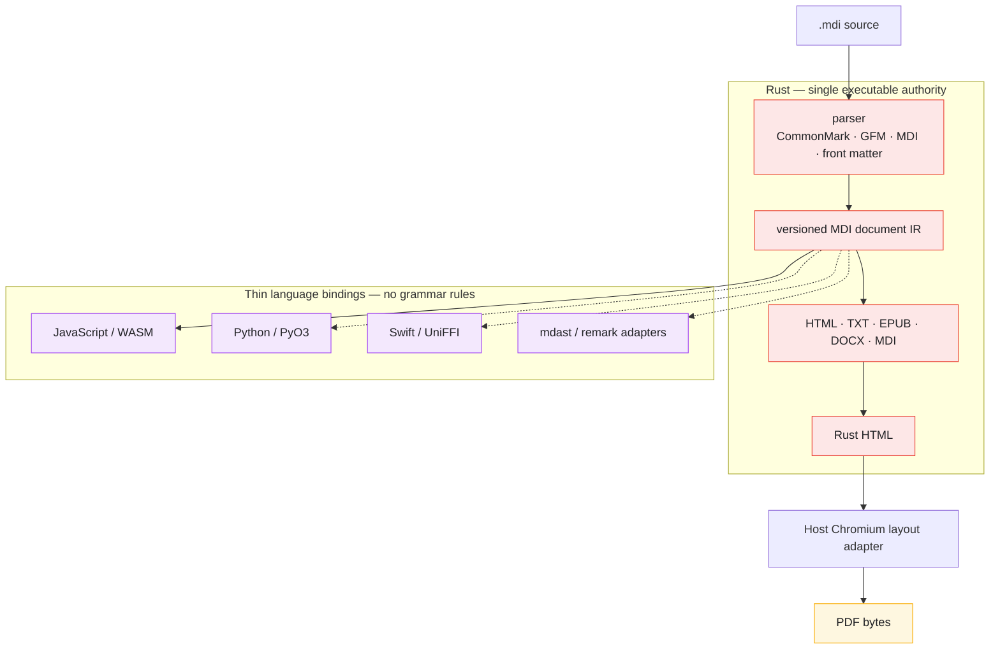

# MDI

[](https://codecov.io/github/illusions-lab/MDI)

**illusion Markdown (MDI)** is a Markdown extension format for Japanese typography — ruby, tate-chu-yoko, boten, warichu, vertical writing, and more, inherited on top of standard Markdown.

**illusion Markdown（MDI）** は、日本語組版のための Markdown 拡張フォーマットです。ルビ・縦中横・傍点・割注・縦書きなどを、標準 Markdown を継承しつつ拡張します。

This repository is the canonical home of the **MDI 2.0 spec**
([SYNTAX.md](./SYNTAX.md)), the Rust implementation, language bindings,
renderers, and developer tools.

本リポジトリは **MDI 2.0 仕様書**（[SYNTAX.md](./SYNTAX.md)）、Rust
実装、各言語バインディング、レンダラー、開発ツールの正規リポジトリです。

Rust is the **only executable authority** for MDI syntax and document
semantics. It parses the complete document grammar—CommonMark, GFM, front
matter, and MDI extensions—into one versioned document IR. JavaScript, Python,
and Swift expose thin interfaces to the same Rust implementation.

本專案採用 **Rust 單一權威架構**：CommonMark、GFM、front matter 與 MDI
擴充語法均由 Rust 解析為同一份版本化文件 IR；JavaScript、Python、Swift
僅提供薄接口。完整的權責與接口契約請見
[`ARCHITECTURE.md`](./ARCHITECTURE.md)。

**📖 Documentation / ドキュメント: https://mdi.illusions.app/** — guides, a live-rendered syntax showcase, and generated API reference (English / 日本語 / 正體中文). Built from [`nodejs/docs/`](./nodejs/docs).

---

## Repository layout / リポジトリ構成

Every language package exposes the same Rust implementation; no package owns
an independent grammar or renderer semantics.

各言語向けパッケージは、独立した構文実装を持たず、単一の Rust 実装へ
接続する薄いバインディングです。

| Directory | Language | Responsibility |
|-----------|----------|----------------|
| [`mdi-core/`](./mdi-core) | Rust | Complete parser, versioned document IR, validation, normalization, serialization, and deterministic HTML/TXT/EPUB/DOCX renderers. |
| [`nodejs/`](./nodejs) | Node.js / TypeScript | JavaScript and WebAssembly bindings, ecosystem adapters, CLI, and documentation. |
| [`swift/`](./swift) | Swift | Native binding to `mdi-core` through UniFFI or a small C ABI. |
| [`python/`](./python) | Python | Native binding to `mdi-core` through PyO3. |

---

## Packages / パッケージ構成 (`nodejs/`)

| Package | Layer | Description |
|---------|-------|-------------|
| [`@illusions-lab/mdi`](./nodejs/packages/mdi) | JavaScript binding | Primary typed API for parsing, validation, normalization, serialization, and rendering through Rust. |
| [`@illusions-lab/mdi-core`](./nodejs/packages/mdi-core) | WebAssembly bridge | Generated low-level WebAssembly interface used by JavaScript packages. |
| [`micromark-extension-mdi`](./nodejs/packages/micromark-extension-mdi) | Ecosystem adapter | Presents Rust-owned parse results through micromark-compatible events; contains no grammar rules. |
| [`mdast-util-mdi`](./nodejs/packages/mdast-util-mdi) | Ecosystem adapter | Maps between the versioned Rust document IR and MDAST object shapes. |
| [`@illusions-lab/mdi-remark`](./nodejs/packages/remark) | Remark adapter | Lets unified pipelines consume the Rust document IR as MDAST without giving remark syntax authority. |
| [`@illusions-lab/mdi-export-profile`](./nodejs/packages/export-profile) | Configuration | Shared typed export profiles; PDF and text use them now, Rust EPUB/DOCX parity follows. |
| [`@illusions-lab/mdi-to-hast`](./nodejs/packages/to-hast) | HAST adapter | Legacy public mdast/HAST compatibility adapter for unified ecosystem consumers. |
| [`@illusions-lab/mdi-to-html`](./nodejs/packages/to-html) | HTML adapter | Legacy public mdast/HAST compatibility adapter. |
| [`@illusions-lab/mdi-to-pdf`](./nodejs/packages/to-pdf) | Layout adapter | Sends Rust-rendered HTML to Chromium; Chromium never parses MDI. |
| [`@illusions-lab/mdi-to-epub`](./nodejs/packages/to-epub) | EPUB adapter | Legacy public mdast compatibility adapter. |
| [`@illusions-lab/mdi-to-docx`](./nodejs/packages/to-docx) | DOCX adapter | Legacy public mdast compatibility adapter. |
| [`@illusions-lab/mdi-cli`](./nodejs/packages/cli) | CLI | `mdi build input.mdi --to html\|pdf\|epub\|docx\|txt...` — thin Rust-backed command-line adapter. |

### Why this split / なぜこの分割か

`mdi-core` owns meaning and deterministic output. Language packages only make
that functionality natural to use in a host ecosystem: typed objects in
JavaScript, MDAST/HAST for unified, Python objects through PyO3, and Swift
types through UniFFI. This separation prevents the same syntax rule from
acquiring different meanings in different languages.

`mdi-core` が文書の意味と決定論的な出力を担い、各言語パッケージはその
機能を JavaScript の型、unified の MDAST/HAST、PyO3、UniFFI など各環境に
適した形で公開するだけです。これにより、同じ構文が言語ごとに異なる意味を
持つことを防ぎます。

---

## Architecture / アーキテクチャ

The architecture is deliberately simple: source enters Rust once, and all
language packages consume the same versioned document IR. Deterministic
renderers live in Rust. PDF uses HTML generated by Rust, with a host
Chromium adapter responsible only for print layout.



The complete ownership rules, IR contract, parser invariants, and renderer
boundaries are documented in [`ARCHITECTURE.md`](./ARCHITECTURE.md).

---

## Development / 開発

`nodejs/` is a [pnpm](https://pnpm.io) + [Turborepo](https://turbo.build)
monorepo; `mdi-core/` is an independent Cargo project.

```bash
cd nodejs
pnpm install
pnpm build
pnpm test
```

```bash
cd mdi-core
cargo build
cargo test
```

Rebuilding the wasm bridge needs a `wasm32-unknown-unknown` Rust target and
`wasm-pack` in addition to the plain `cargo build`/`cargo test` toolchain
above; `pnpm build` in `nodejs/` runs it as part of the normal workspace
build.

CI runs the Rust core natively on Linux, macOS, and Windows for both x64 and
ARM64. The JavaScript integration suite, including Chromium PDF output, runs
on Linux x64. Every language binding runs the shared parser, diagnostic, and
renderer conformance fixtures.

### Versioning / バージョニング

Every package's version is `<MDI spec version>.<package release number>` — the major.minor pair always equals the MDI spec version this repository implements (`2.0`), and the patch number is each package's own independent release count, **starting at `.1`** (never `.0`) for the first release under a given spec version. For example the first release under MDI 2.0 is `2.0.1`; a later fix to just `@illusions-lab/mdi-to-docx` might be `2.0.7` while `@illusions-lab/mdi-to-html` is still `2.0.3` — patch numbers are independent per package, only major.minor is shared.

すべてのパッケージのバージョンは `<MDI 仕様バージョン>.<パッケージ自身のリリース回数>` です。major.minor はこのリポジトリが対応する MDI 仕様バージョン（現在 `2.0`）に常に一致し、patch は各パッケージが独自にカウントするリリース回数で、そのバージョンで最初のリリースは `.0` ではなく **`.1` から始まります**。例えば MDI 2.0 対応の初回リリースは `2.0.1`。以降、`@illusions-lab/mdi-to-docx` だけ修正を重ねて `2.0.7` になっても `@illusions-lab/mdi-to-html` は `2.0.3` のまま、というように patch は各パッケージ独立です。

- **Ordinary releases** (same spec version): use Changesets as normal — always choose a **patch** bump, never minor/major.  
  **通常のリリース**（同じ仕様バージョン内）: 通常どおり Changesets を使い、常に **patch** bump のみを選びます（minor/major は使いません）。

  ```bash
  cd nodejs
  pnpm changeset       # record what changed; always pick "patch"
  pnpm version         # apply pending changesets
  pnpm release         # build + publish
  ```

- **Spec version bump** (e.g. MDI 2.0 → 2.1): Changesets has no concept of "MDI spec version," so this is a separate, explicit step — it rewrites every package's version to `<new spec version>.1` regardless of each package's prior patch count.  
  **仕様バージョンの引き上げ**（例: MDI 2.0 → 2.1）: Changesets は「MDI 仕様バージョン」という概念を知らないため、これは別の明示的な手順です。各パッケージの直前の patch 数に関係なく、全パッケージのバージョンを `<新しい仕様バージョン>.1` へ書き換えます。

  ```bash
  cd nodejs
  pnpm bump-spec-version 2.1
  ```

---

## Related projects / 関連プロジェクト

- [illusions-lab/milkdown-mdi](https://github.com/illusions-lab/milkdown-mdi) — Milkdown editor plugins for MDI syntax support and vertical writing (縦書き) display.

---

## License

The Node.js tooling (`nodejs/`) and the Rust core (`mdi-core/`) are MIT — see [LICENSE](./LICENSE).

The MDI specification ([`SYNTAX.md`](./SYNTAX.md)) is public domain — see [LICENSE-SPEC](./LICENSE-SPEC).
